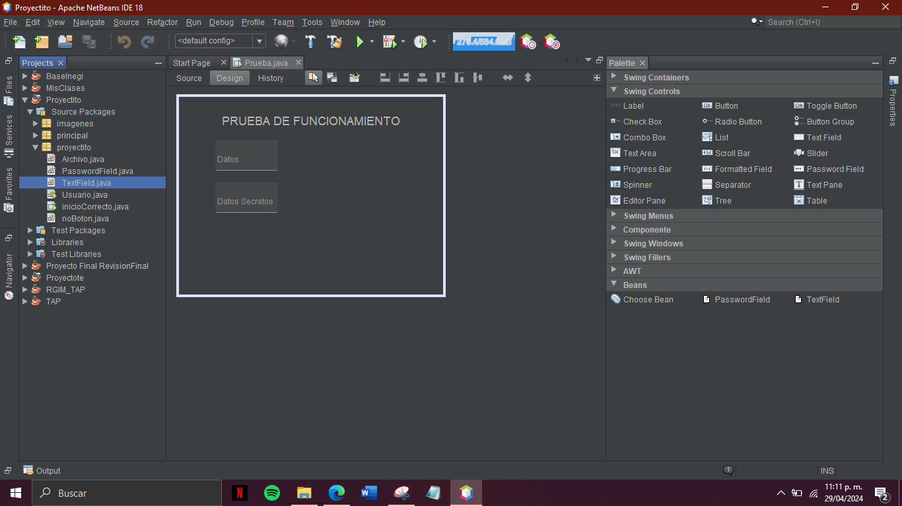

# Sistema gestor de actividades complementarias

## Descripción
Un Sistema Gestor de Actividades Complementarias es una plataforma diseñada para organizar y administrar diversas actividades que complementan la formación académica o laboral de las personas. Estas actividades pueden incluir conferencias, talleres, cursos, eventos culturales, voluntariado, prácticas profesionales, entre otros.

1. Gestión de usuarios:

Docentes: El sistema permite registrar y administrar perfiles de docentes, incluyendo información como nombre, especialidad, horario de disponibilidad, y asignación de actividades.
Alumnos: Los alumnos también tienen perfiles dentro del sistema, donde pueden acceder a información sobre las actividades disponibles, inscribirse en ellas, y ver su historial de participación.
Administradores: Existe un rol de administrador que supervisa y gestiona todo el sistema, teniendo acceso a funciones avanzadas como la creación de actividades, la generación de informes y la administración de usuarios.

2. Gestión de actividades:

Los docentes pueden crear nuevas actividades, especificando detalles como el título, la descripción, la fecha, la hora, el lugar y la capacidad máxima de participantes.
Los alumnos pueden explorar las actividades disponibles, filtrarlas por categoría o fecha, e inscribirse en aquellas de su interés.
El sistema gestiona automáticamente las inscripciones, enviando notificaciones a los alumnos confirmados y actualizando el estado de las actividades en tiempo real.

3. Comunicación:

El sistema envía correos electrónicos automáticos a los usuarios para notificarles sobre actividades próximas, cambios en los horarios o actualizaciones importantes.
Los docentes pueden enviar mensajes a los alumnos inscritos en sus actividades, proporcionando información adicional o respondiendo preguntas específicas.

4. Gestión de archivos:

El sistema permite a los docentes y administradores subir archivos relevantes, como horarios de actividades, material didáctico o constancias de participación.
Los alumnos pueden acceder a estos archivos desde sus perfiles, descargándolos según sea necesario.

5. Generación de constancias:

Después de completar una actividad, el sistema genera automáticamente constancias de participación para los alumnos inscritos, que pueden descargar desde sus perfiles.
Los docentes pueden verificar la asistencia de los alumnos y aprobar la emisión de constancias, garantizando la validez y precisión de la documentación.

## Patrón Modelo-Vista-Controlador (MVC) Utilizado y usos
En este sistema de gestión de actividades complementarias, se ha implementado el patrón Modelo-Vista-Controlador (MVC) para organizar y estructurar el código de manera modular y eficiente. A continuación, se describe cómo se aplica este patrón en las diferentes capas del sistema:

Modelo
El modelo se encarga de representar los datos y la lógica de negocio de la aplicación. En este caso, el modelo contiene dos clases principales:

Clase Conexion: Esta clase establece la conexión con la base de datos MySQL y provee métodos para realizar operaciones de consulta, inserción, actualización y eliminación de datos.
Clase Consultas: Aquí se definen las consultas específicas de MySQL para obtener diferentes tipos de datos relacionados con las actividades, usuarios y otros elementos del sistema. Esta clase encapsula las consultas SQL para reutilizarlas fácilmente en diferentes partes de la aplicación.

Vista
La vista se encarga de la presentación de la interfaz de usuario y la interacción con el usuario. En este sistema, la vista está compuesta por varias clases que representan diferentes pantallas y componentes de la interfaz de usuario:

Clase ActividadDocente: Presenta la vista de una actividad para un docente, mostrando detalles y opciones relacionadas con la actividad.
Clase ActividadActualAlumno: Muestra la vista de la actividad actual para un alumno, permitiéndole interactuar con la misma según su rol y estado.
Clase AgregarActividad: Proporciona la interfaz para que un docente pueda agregar una nueva actividad al sistema.
Clase Docente y Alumno: Representan las vistas de perfil para un docente y un alumno respectivamente, mostrando información y opciones relacionadas con cada usuario.
Clase CambiarContraseña: Permite a los usuarios cambiar su contraseña desde la interfaz.
Clase EstadisticaDocente: Presenta estadísticas y métricas relevantes para un docente, ayudándole a evaluar el rendimiento de sus actividades.
Clase EvaluarAlumno: Proporciona la interfaz para que un docente evalúe el desempeño de un alumno en una actividad específica.
Clase GestionarAlumno: Permite a un docente gestionar la participación de un alumno en sus actividades.
Clases de Menú: Se incluyen varias clases que representan menús para diferentes tipos de usuarios, como docentes, alumnos y administradores, proporcionando opciones de navegación y acceso a diferentes funcionalidades del sistema.
Clase Login y Registro: Presentan la vista para iniciar sesión y registrar un nuevo usuario en el sistema.
Clase UnirseActividad: Proporciona la interfaz para que un alumno se una a una actividad disponible en el sistema.

Controlador
El controlador actúa como intermediario entre el modelo y la vista, gestionando las solicitudes del usuario y coordinando las acciones necesarias. En este sistema, el controlador está compuesto por las siguientes clases:

Clase Correo: Contiene un método para enviar correos electrónicos con documentos PDF adjuntos, utilizado para notificar a los usuarios sobre actividades, cambios en su estado, etc.
Clase Documento: Define la estructura y contenido base de los documentos PDF que se adjuntan a los correos electrónicos enviados por el sistema.
Cada componente del patrón MVC cumple un rol específico y contribuye a la modularidad, legibilidad y mantenibilidad del código en el sistema de gestión de actividades complementarias. La separación clara de responsabilidades entre el modelo, la vista y el controlador facilita el desarrollo, la depuración y la evolución continua de la aplicación.

Componente de texto:
1.	Formularios de registro: Se utilizan para recopilar información como nombre, dirección de correo electrónico, carrera, etc.
2.	Búsquedas: Permiten a los usuarios ingresar consultas de búsqueda para encontrar contenido dentro de una aplicación o sitio web.
3.	Comentarios: En aplicaciones y sitios web que permiten a los usuarios dejar comentarios, se utilizan componentes de texto para que ingresen sus comentarios.
4.	Mensajería: En aplicaciones de mensajería, los usuarios pueden ingresar mensajes de texto para enviar a otros usuarios.
5.	Edición de perfil: Permiten a los usuarios actualizar su información personal, como su contraseña, correo, etc.

Componente de contraseña:
1.	Inicio de sesión: Se utiliza para que los usuarios ingresen contraseñas para acceder a sus cuentas protegidas por contraseña.
2.	Registro: Al registrarse en un servicio, los usuarios a menudo deben crear una contraseña para proteger su cuenta.
3.	Cambiar contraseña: Permite a los usuarios cambiar su contraseña actual por una nueva.
4.	Confirmación de identidad: En algunos casos, como al realizar transacciones financieras, se solicita a los usuarios que ingresen su contraseña como medida de seguridad adicional.


## Características
1.	Etiqueta de texto: Permite establecer una etiqueta de texto que se muestra encima del campo de contraseña.
2.	Color de línea: Permite personalizar el color de la línea que aparece debajo del campo de contraseña.
3.	Animación de texto de sugerencia: Realiza una animación suave del texto de sugerencia cuando el campo de contraseña gana o pierde foco.
4.	Animación de línea: Realiza una animación suave de la línea que aparece debajo del campo de texto cuando este gana o pierde foco, proporcionando una experiencia visual agradable y una indicación clara del estado del campo.
5. Gestión de usuarios: Permite registrar y gestionar usuarios, incluyendo docentes, alumnos y administradores, con perfiles personalizados y diferentes niveles de acceso.
6. Gestión de actividades: Permite crear, programar y gestionar diversas actividades complementarias, como conferencias, talleres, cursos, eventos culturales, etc.
7. Inscripciones: Facilita a los usuarios inscribirse en las actividades de su interés y llevar un registro de su participación.
8. Comunicación: Proporciona herramientas de comunicación, como notificaciones por correo electrónico, para informar a los usuarios sobre nuevas actividades, cambios en su estado, recordatorios, etc.
9. Gestión de recursos: Permite asignar y gestionar recursos necesarios para las actividades, como aulas, materiales, equipos, etc.
10. Seguimiento y evaluación: Facilita el seguimiento de la participación de los usuarios en las actividades y la evaluación del impacto y la efectividad de las mismas.
11. Generación de constancias: Permite generar automáticamente constancias de participación para los usuarios que completen satisfactoriamente las actividades.
12. Interfaz intuitiva: Ofrece una interfaz de usuario fácil de usar y navegación intuitiva para facilitar la interacción de los usuarios con el sistema.
13. Personalización: Permite personalizar la experiencia del usuario, mostrando actividades relevantes según intereses, nivel académico, área de estudio, etc.
14. Seguridad: Garantiza la seguridad de los datos y la privacidad de los usuarios mediante medidas como autenticación segura, control de acceso y cifrado de datos.
15. Informes y estadísticas: Proporciona informes y estadísticas sobre la participación de los usuarios para facilitar la toma de decisiones y la mejora continua del sistema.
16. Compatibilidad: Es compatible con diferentes dispositivos y plataformas, como computadoras de escritorio, dispositivos móviles y tablets, para garantizar el acceso a la información en cualquier momento y lugar.
    
## Requisitos password-field
+ Java Runtime Environment (JRE) instalado en el sistema.
+ Bibliotecas externas como org.jdesktop.animation.timing.Animator y org.jdesktop.animation.timing.TimingTarget que deben estar disponibles en el classpath durante la compilación y ejecución.

## Requisitos text-field
1.	Java Runtime Environment (JRE): Se requiere tener instalado Java Runtime Environment en el sistema para ejecutar aplicaciones Java que utilicen este componente de campo de texto personalizado.
2.	Bibliotecas externas: El código hace uso de bibliotecas externas como org.jdesktop.animation.timing.Animator y org.jdesktop.animation.timing.TimingTarget para realizar animaciones. Estas bibliotecas deben estar disponibles en el classpath durante la compilación y ejecución del código.
3.	Entorno de desarrollo: Se necesita un entorno de desarrollo Java, como Eclipse, NetBeans o IntelliJ IDEA, para compilar y trabajar con el código fuente de este componente de campo de texto personalizado.
4.	Sistema operativo compatible: Este componente de campo de texto personalizado debería ser compatible con cualquier sistema operativo que admita la ejecución de aplicaciones Java, como Windows, macOS y Linux.

## Requisitos para correo
1.	Java Runtime Environment (JRE): Se requiere tener instalado Java Runtime Environment en el sistema para ejecutar aplicaciones Java que utilicen este componente de campo de texto personalizado.
2.	Bibliotecas externas: El código hace uso de bibliotecas externas como javax.activation y javax.mail para mandar correos. Estas bibliotecas deben estar disponibles en el classpath durante la compilación y ejecución del código.
3.	Entorno de desarrollo: Se necesita un entorno de desarrollo Java, como Eclipse, NetBeans o IntelliJ IDEA, para compilar y trabajar con el código fuente de este componente de campo de texto personalizado.
4.	Sistema operativo compatible: Este componente de campo de texto personalizado debería ser compatible con cualquier sistema operativo que admita la ejecución de aplicaciones Java, como Windows, macOS y Linux.

## Requisitos para documento
1.	Java Runtime Environment (JRE): Se requiere tener instalado Java Runtime Environment en el sistema para ejecutar aplicaciones Java que utilicen este componente de campo de texto personalizado.
2.	Bibliotecas externas: El código hace uso de bibliotecas externas como java.itextpdf para mandar correos. Estas bibliotecas deben estar disponibles en el classpath durante la compilación y ejecución del código.
3.	Entorno de desarrollo: Se necesita un entorno de desarrollo Java, como Eclipse, NetBeans o IntelliJ IDEA, para compilar y trabajar con el código fuente de este componente de campo de texto personalizado.
4.	Sistema operativo compatible: Este componente de campo de texto personalizado debería ser compatible con cualquier sistema operativo que admita la ejecución de aplicaciones Java, como Windows, macOS y Linux.

## Requisito para conexión 
1.	Java Runtime Environment (JRE): Se requiere tener instalado Java Runtime Environment en el sistema para ejecutar aplicaciones Java que utilicen este componente de campo de texto personalizado.
2.	Bibliotecas externas: El código hace uso de bibliotecas externas como mysqlconnector para mandar correos. Estas bibliotecas deben estar disponibles en el classpath durante la compilación y ejecución del código.
3.	Una base de datos funcional con registros en MySql.
4.	Entorno de desarrollo: Se necesita un entorno de desarrollo Java, como Eclipse, NetBeans o IntelliJ IDEA, para compilar y trabajar con el código fuente de este componente de campo de texto personalizado.
5.	Sistema operativo compatible: Este componente de campo de texto personalizado debería ser compatible con cualquier sistema operativo que admita la ejecución de aplicaciones Java, como Windows, macOS y Linux.


## API
### PasswordField

#### Descripción
Con la clase `passwordfield` los desarrolladores pueden crear campos de contraseña que ofrecen una experiencia de usuario más atractiva, personalizada y funcional. 

#### Constructor
| Constructor | Descripción |
|-------------|-------------|
| `PasswordField()` | Constructor por defecto que inicializa un campo de contraseña con configuraciones predeterminadas. |


#### Métodos
| Nombre | Tipo de Dato que Retorna | Tipo de dato que recibe | Descripción |
|--------|--------|-------------------------|-------------|
| `setLabelText(String labelText)` | ninguno | `labelText`: El texto de la etiqueta. | Establece la etiqueta de texto que se mostrará encima del campo de contraseña. |
| `setLineColor(Color lineColor)` | ninguno | `lineColor`: El color de la línea. | Establece el color de la línea que aparece debajo del campo de contraseña. |
| `getText()` | 'String' | void | Devuelve el texto actualmente ingresado en el campo de contraseña. |
| `setText(String text)` | String | `text`: El texto que se establecerá. | Devuelve el texto actualmente ingresado en el campo de contraseña. |

---

### TextField

#### Descripción
`TextField` es un componente personalizado de Java Swing diseñado para manejar campos de texto en interfaces de usuario. Este componente extiende la funcionalidad básica proporcionada por el JTextField estándar al agregar características adicionales de estilo y animación.


#### Constructores
| Constructor | Descripción |
|-------------|-------------|
| `TextField()` | Constructor por defecto que inicializa un campo de texto con configuraciones predeterminadas. |

#### Métodos
| Nombre                    | Tipo de Dato que Retorna | Tipo de dato que recibe                    | Descripción                                                                                                |
| ------------------------- | ------------------------ | ------------------------------------------ | ---------------------------------------------------------------------------------------------------------- |
| `setLabelText(String labelText)`    | void                  | `labelText` | Establece la etiqueta de texto que se mostrará encima del campo de texto.                              |
| `setLineColor(Color lineColor)`                   | void                 |  `lineColor`                           | Establece el color de la línea que aparece debajo del campo de texto.              |
| `setText` | Ninguno                | `text`           | Establece el texto del campo de texto y realiza animaciones según sea necesario. |


### Clase login:
### Constructores:

public login(): Constructor que inicializa la interfaz de inicio de sesión y configura los componentes visuales como los campos de texto y los botones.
### Métodos Públicos:

public static void main(String args[]): Método principal que inicia la aplicación.
private void initComponents(): Método generado automáticamente que inicializa todos los componentes de la interfaz de usuario.
private void checkCMouseClicked(java.awt.event.MouseEvent evt): Método que maneja el evento de clic en el checkbox para mostrar u ocultar la contraseña.
private void registrarseMouseClicked(java.awt.event.MouseEvent evt): Método que maneja el evento de clic en el enlace "Registrarse".
private void seccionAMouseClicked(java.awt.event.MouseEvent evt): Método que maneja el evento de clic en la sección de alumno.
private void seccionBMouseClicked(java.awt.event.MouseEvent evt): Método que maneja el evento de clic en la sección de docente.
private void seccionCMouseClicked(java.awt.event.MouseEvent evt): Método que maneja el evento de clic en la sección de administrador.
private void ingresarMouseClicked(java.awt.event.MouseEvent evt): Método que maneja el evento de clic en el botón de "Ingresar".
private void ingresarMouseClicked(): Método que maneja el evento de clic en el botón de "Ingresar" cuando se presiona la tecla Enter.
Atributos:

private consultas validar: Objeto de la clase consultas utilizado para realizar validaciones de inicio de sesión.
public static String usuario: Variable estática que almacena el tipo de usuario (alumno, docente, administrador).
public static String ncontrol: Variable estática que almacena el número de control del usuario.

### Actividad actual alumno
### Paquete y Clase Principal:

El código está contenido en el paquete Vista.
La clase principal se llama menuAlumno, que representa el menú principal para los alumnos.
Atributos de Clase:

private consultas consultar;: Objeto de la clase consultas utilizado para realizar consultas a la base de datos.
private login metodo;: Objeto de la clase login utilizado para acceder a la información de inicio de sesión del alumno.

### Constructor:

El constructor menuAlumno() inicializa la interfaz del menú principal del alumno y configura los componentes visuales, como los botones y los enlaces.
También inicializa los objetos de consulta y obtiene información específica del alumno, como su saludo personalizado y su estado de inscripción en actividades.
Métodos:

initComponents(): Método generado automáticamente que inicializa todos los componentes de la interfaz de usuario.
Métodos privados que manejan eventos de clic en diferentes secciones del menú, como ver la actividad actual, unirse a una actividad o ver constancias.
perfilMouseEntered(): Maneja el evento de entrada del ratón en el icono de perfil, mostrando un menú emergente con opciones como cambiar la contraseña o cerrar sesión.
Métodos que manejan acciones específicas como cambiar la contraseña o cerrar sesión.
### Interfaz de Usuario:

La interfaz incluye un icono de perfil, un saludo personalizado para el usuario, secciones para ver la actividad actual, unirse a una actividad y ver constancias.
También incluye un menú emergente para acciones adicionales como cambiar la contraseña o cerrar sesión.
Eventos de Interfaz de Usuario:

Los eventos de clic en los componentes de la interfaz de usuario se manejan utilizando métodos específicos que realizan acciones como abrir nuevas ventanas para ver la actividad actual, unirse a actividades o ver constancias.
El evento de entrada del ratón en el icono de perfil muestra un menú emergente con opciones adicionales.

### Clase menu admin:
### Componentes Principales
Consultas y Login

La clase tiene dos variables privadas: consultar y metodo, que son instancias de las clases consultas y login, respectivamente.
El constructor de menuAdmin inicializa estos objetos y llama a un método saludo de consultas para mostrar un saludo en la GUI.
Menú Popup

Un JPopupMenu llamado jPopupMenu1 que contiene dos elementos de menú (JMenuItem): cambiarContra y cerrarSesion. Estos permiten al usuario cambiar su contraseña o cerrar sesión.
Panel Principal

Un JPanel principal (jPanel1) que contiene varios componentes:
Un icono de perfil (perfil).
Un logo de la aplicación (jLabel1).
Un título del menú (jLabel2).
Una etiqueta para mostrar un saludo (lblsaludo).
Paneles de Gestión

Tres paneles (gestionarAlumnos, gestionarActividades y gestionarDocentes) que representan diferentes secciones del menú donde el administrador puede gestionar alumnos, actividades y docentes.
### Eventos y Listeners
Acciones del Menú Popup

cambiarContraActionPerformed: Muestra la ventana para cambiar la contraseña y cierra la ventana actual.
cerrarSesionActionPerformed: Cierra la sesión actual y vuelve a la pantalla de login.
Acción del Perfil

perfilMouseEntered: Muestra el menú popup cuando el ratón pasa sobre el icono del perfil.
Acciones de Gestión

Cada uno de los paneles de gestión tiene un evento de clic (mouseClicked) que abre la ventana correspondiente y cierra la ventana actual.

### Clase menu docente

Descripción General
Esta clase, menuDocente, extiende javax.swing.JFrame y define la interfaz gráfica para el menú principal que usan los docentes en la aplicación. La interfaz permite a los docentes ver las actividades que imparten, generar estadísticas y realizar otras acciones como cambiar la contraseña o cerrar sesión.

### Componentes Principales
Consultas y Login

consultar y metodo son instancias de las clases consultas y login, respectivamente.
El constructor de menuDocente inicializa estos objetos y llama al método saludo de consultas para mostrar un saludo personalizado en la GUI.
Menú Popup

jPopupMenu1 es un menú emergente que contiene dos elementos (cambiarContra y cerrarSesion) que permiten al usuario cambiar su contraseña o cerrar sesión.
Panel Principal

jPanel1 es el panel principal que contiene:
Un icono de perfil (perfil).
Un logo de la aplicación (jLabel1).
Un título del menú (jLabel2).
Una etiqueta de saludo (lblsaludo).
Paneles de Gestión

actividadesAdministro y historialActividades son paneles que permiten a los docentes ver las actividades que imparten y generar estadísticas, respectivamente.
### Eventos y Listeners
Acciones del Menú Popup

cambiarContraActionPerformed: Abre la ventana para cambiar la contraseña y cierra la ventana actual.
cerrarSesionActionPerformed: Cierra la sesión actual y vuelve a la pantalla de inicio de sesión.
Acciones de Gestión

actividadesAdministroMouseClicked: Abre la ventana de actividades administradas por el docente.
historialActividadesMouseClicked: Abre la ventana de estadísticas del docente.
Acción del Perfil

perfilMouseEntered: Muestra el menú popup cuando el ratón pasa sobre el icono del perfil.

### Uso de Métodos y Componentes
Componentes de Swing

Utiliza varios componentes de Swing (JPanel, JLabel, JMenuItem, etc.) para construir la interfaz gráfica.
Métodos de Acción

Métodos como cambiarContraActionPerformed, cerrarSesionActionPerformed, actividadesAdministroMouseClicked, etc., manejan las interacciones del usuario

## Instalación
Para utilizar este componente en tu proyecto, sigue estos pasos:

1. Obtener el repositorio
   Clona con el siguiente comando

   ```bash
      git clone https://github.com/Marquitos1234567/ITO_TAP_U2_COMPONENTE_PASSWORD-FIELD_TEXT-FIELD
   ```

   Otra opción es descargar `ZIP`.
   
   
3. Importa el proyecto en tu IDE preferido (NetBeans o VS code).

4. Asegúrate de que el proyecto se compila sin errores para crear el `.jar` según la versión de tu Java.

## Uso
1. Compila tu proyecto para crear el archivo `.jar`

   
   Posteriormente presiona `SHIFT + F11`

2. Agrega el componente a tu paleta de componentes.
   Da click derecho en la clase con el codigo para el componente, luego en *Tools* y *add to palette*

   
   seleccionamos la categoria en la que queremos que este
   
   

4. Ya está listo para usar y arrastrar a tus componentes
   

## Funcionamiento
Ingresamos los datos del alumno que serán su número de control y contraseña.

Desde el menú podemos ver los distintas opciones del usuario.


La actividad actual, donde podemos descargar nuestro horario en formato PDF.


El cuál se almacena en nuestra carpeta de decargas.

En el caso de no pertenecer a alguna actividad nos mostrará el siguiente mensaje:

En el apartado de unirse a actvidad el usuario puede selecionar la actividad que desee.

Al presionar el botón incribirse nos unimos en la actividad y el horario será enviado a su correo. 

Aquí algunos ejemplos:


Al pasar el mouse por el logo del usuario podemos cambiar la contraseña y cerrar sesión: 

Tendremos que ingresar nuestra contraseña anterior y la nueva.

Cerramos sesión y comprobamos.


Antes de poder iniciar sesión se debe de estar registrado, proceso que solo puede hacer por si solo el alumno, en caso del docente un administrador debe de
registrarlo y el propio administrador ya debe de registrarse con anticipación directamente en la base de datos. En la siguiente pantalla tenemos los campos de
texto que se tiene que rellenar con nuestros datos reales para poder hacer el registro


## Autores
+ Cuevas Estevez Marcos Gabriel - Estudiante del ITO 
+ Ruiz Garcia Itzi Mariana - Estudiante del ITO  
